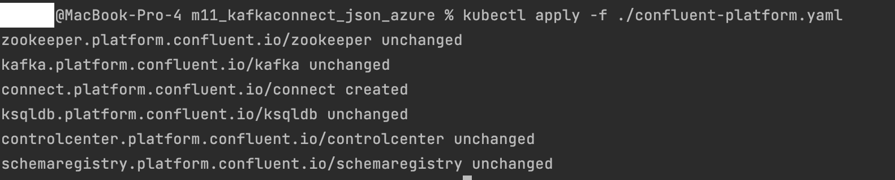

# Kafka Connect in Kubernetes Homework

### Repository link https://github.com/MeriDm7/kafka-connect.git

## Install Confluent Hub Client

You can find the installation manual [here](https://docs.confluent.io/home/connect/confluent-hub/client.html)

Run:
```bash
brew tap confluentinc/homebrew-confluent-hub-client
brew install --cask confluent-hub-client
```

Verify the installation:


## Create a custom docker image

For running the azure connector, you can create your own docker image. Create your azure connector image and build it.

Change the kafka-connect-azure-blob-storage and kafka-connect-azure-blob-storage-source images versions to the latest.

Build image

Push image


## Setup infrastructure
- Download `m11kafkaconnect.zip` file.
- Navigate to the `dataStorage` folder inside the `terraform` directory. Add the path to the downloaded m11kafkaconnect data in  the`data_storage_upload.tf` file, and then run the Terraform scripts.

```bash
terraform init
terraform apply
```
- Navigate to the `terraform` directory and run Terraform scripts again.
- The Kubernetes Service and Storage Account are deployed.
## Launch Confluent for Kubernetes

### Connect to the AKS cluster

```bash
az aks get-credentials --resource-group yourResourceGroupName --name yourClusterName
```

### Create a namespace

- Create the namespace to use:

  ```cmd
  kubectl create namespace confluent
  ```

- Set this namespace to default for your Kubernetes context:

  ```cmd
  kubectl config set-context --current --namespace confluent
  ```
  


### Install Confluent for Kubernetes

- Add the Confluent for Kubernetes Helm repository:

  ```cmd
  helm repo add confluentinc https://packages.confluent.io/helm
  helm repo update
  ```

- Install Confluent for Kubernetes:

  ```cmd
  helm upgrade --install confluent-operator confluentinc/confluent-for-kubernetes
  ```

  


## Create your own connector's image

- Create your own connector's docker image using provided Dockerfile and use it in confluent-platform.yaml

In the `confluent-platform.yaml file` change `application: my-azure-connector:1.0.0` to `application: <LOCAL_IMAGE_NAME>`
### Install Confluent Platform

- Install all Confluent Platform components:

  ```cmd
  kubectl apply -f ./confluent-platform.yaml
  ```
  


- Install a sample producer app and topic:

  ```cmd
  kubectl apply -f ./producer-app-data.yaml
  ```
  


- Check that everything is deployed:

  ```cmd
  kubectl get pods -o wide 
  ```

  


### View Control Center

- Set up port forwarding to Control Center web UI from local machine:

  ```cmd
  kubectl port-forward controlcenter-0 9021:9021
  ```

- Browse to Control Center: [http://localhost:9021](http://localhost:9021)

  

## Create a kafka topic

- The topic should have at least 3 partitions because the azure blob storage has 3 partitions. Name the new topic: "expedia".

  

## Prepare the azure connector configuration

- Add configurations to `azure-source-cc-expedia.json` file. Include `transforms` configuration to mask time from the date field.

  

## Upload the connector file through the API

- Upload the connector using `Upload connector config file` tab and select `azure-source-cc-expedia.json` file
  

- Check `expedia` topic messages. `DateTimeMask` transformation is applied.
  


